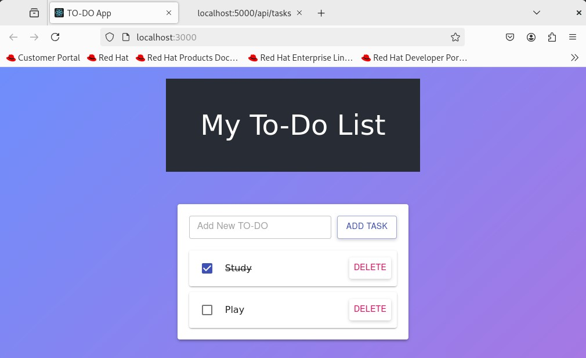
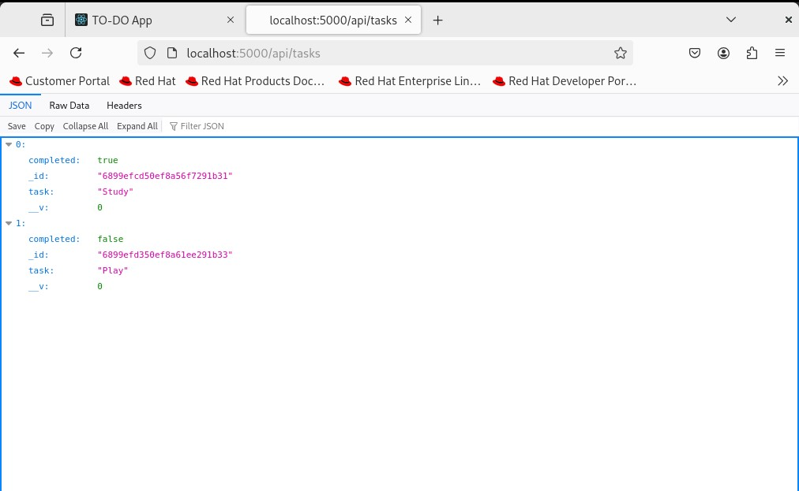

# 📝 Secure To-Do List — Three-Tier Application

> **Note:** This application was **not developed by me**.  
> I am using it purely for **educational, learning, and testing purposes** within a DevSecOps project context.

---

This is a simple **To-Do List** application built as a **three-tier architecture**:
1. **Frontend** — React.js (UI for users to add/manage tasks)
2. **Backend** — Node.js + Express.js (REST API handling CRUD operations)
3. **Database** — MongoDB (stores tasks)

The goal is to serve as the **application layer** for DevSecOps and production deployment projects.

---

## 📌 Features
- Create, read, update, and delete tasks.
- API built with **Express.js** and connected to MongoDB using **Mongoose**.
- React frontend with a clean and simple interface.
- Designed for containerization with **Docker** and orchestration later.

---

## 🏗 Architecture Overview

      


The flow:
- **Frontend** sends HTTP requests to backend API.
- **Backend** processes requests and interacts with the database.
- **MongoDB** stores tasks in a collection.

---

## 📂 Project Structure

Application-Code/
├── backend/
│ ├── models/ # MongoDB schemas (Mongoose)
│ ├── routes/ # Express route handlers
│ ├── db.js # Database connection logic
│ ├── index.js # Backend app entry point
│ └── package*.json # Backend dependencies
│
├── frontend/
│ ├── public/ # Public static files
│ ├── src/ # React components & logic
│ └── package*.json # Frontend dependencies
│ 
├── docker-compose.yml # Local multi-container orchestration
├── Dockerfile.backend # Backend container definition
└── Dockerfile.frontend # Frontend container definition


---

## 🚀 Run Locally with Docker Compose

### 1️⃣ Prerequisites
- [Docker](https://docs.docker.com/get-docker/)
- [Docker Compose](https://docs.docker.com/compose/install/)

### 2️⃣ Environment Variables
Change the `env` file in the `docker-compose.yml` if you want:
```env
PORT=3500
MONGO_INITDB_ROOT_USERNAME: admin
MONGO_INITDB_ROOT_PASSWORD: password
MONGO_CONN_STR: mongodb://admin:password@db:27017/myapp?authSource=admin
USE_DB_AUTH: "true"
```

### 3️⃣ Start the App
```bash
# Go to Application-Code directory
cd Application-Code/
docker-compose up --build
```
This will:
- Build frontend and backend images from their Dockerfiles.
- Start MongoDB in a container.
- Link all services via Docker networking.

### 4️⃣ Access the App
- Frontend UI: http://localhost:8080
- Backend API health check: http://localhost:3500/ok
- View tasks (raw JSON): http://localhost:3500/api/tasks


---

## 🧪 Testing the API (Optional)
```bash
# Get all tasks
curl http://localhost:3500/api/tasks

# Add a task
curl -X POST http://localhost:3500/api/tasks \
-H "Content-Type: application/json" \
-d '{"task": "Learn DevSecOps", "completed": true}'
```
